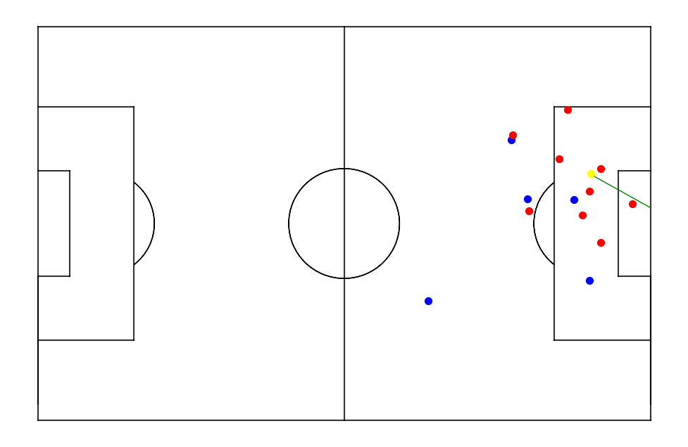

# xG-Regression-Model

## Introduction
This project explores **Expected Goals (xG)** in football analytics using logistic regression. By engineering meaningful features and leveraging SHAP analysis, we developed a model that provides actionable insights into goal-scoring probabilities.

---

## Dataset
The dataset includes detailed information on individual shots during matches:
- **Spatial Features:** Coordinates, distances, angles.
- **Contextual Features:** Headers, penalty area, defensive pressure.
- **Dynamic Features:** Nearest opponent distances, average distances of teammates/opponents.

---

## Features
Some of the key engineered metrics:
- **Distance to Goal:** Measures the shooter's distance to the goal center.
- **Pressure:** Quantifies defensive pressure using distance-based decay.
- **Header Angle Distance Metric:** Combines angles and distances for header scenarios.
- **Goal Distance vs. Opponent Distance:** Evaluates the relative positioning of the shooter and closest defender.

---

## Model Evolution
The xG model was developed iteratively:
1. **Baseline Model:** Basic features like `distance_to_goal` and `angle_to_goal`.
2. **Intermediate Model:** Added defensive metrics (`pressure`, `nearest_opponent_distance`).
3. **Final Model:** Integrated advanced metrics like `header_angle_distance_metric` and `goal_distance_vs_opponent_distance`.

---

## Results
### Calibration Curve
The final model demonstrates significantly improved calibration.  

### ROC Curve
The ROC curve shows an AUC of **0.80**, outperforming baseline models.  

### SHAP Analysis
Key features influencing the xG model predictions:  

---

